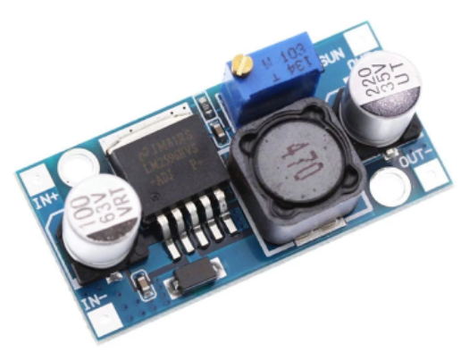

# scooterLightsBoard
Add lights to the scooter

The board uses the internal 12 volts to enable a relay.
That relay enables the stepdown and the front light.
The stepdown is a 4,5-60V LM2596HV. It must be regulated to 12v (or whatever voltage needed) before instalation to avoid damage.

The frontlight needs a separate switch to activate it independently.

The inputs of the board are:
* (J1) Drv signals:
  1. 12v signal
  2. Gnd
  3. Tail light signal
* (J2) Battery power:
  1. Batt +
  2. Batt -

The outputs are:
* (J3) Frontlight:
  1. Batt + (relay)
  2. 12v
  3. Gnd
* (J5) 12V output:
  1. 12v
  2. Gnd
* (j4) Tail light:
  1. Tail light+ (12v)
  2. Tail light-

Greetings from Spain

Camilo
